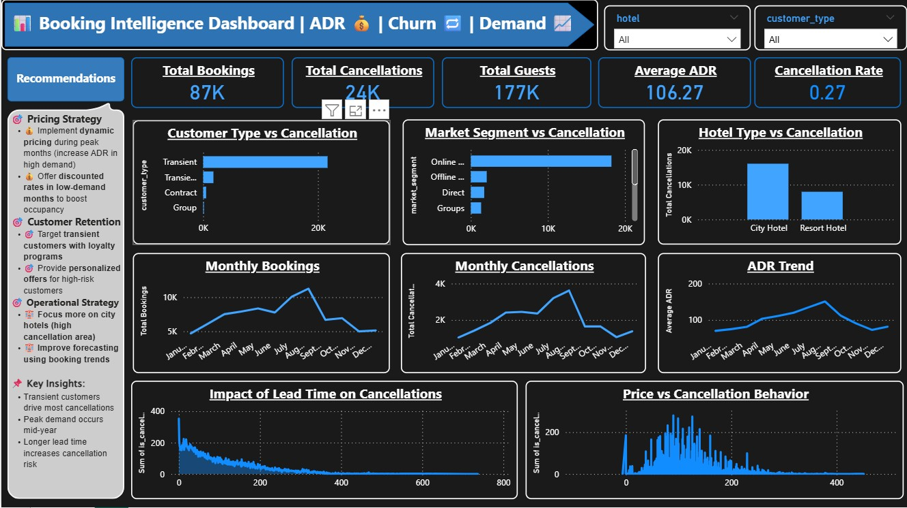

# 🏨 Booking Intelligence Dashboard | AI + Power BI Project

## 📌 Project Overview
This project analyzes hotel booking data to understand **customer behavior, cancellation trends, and pricing strategies** in the travel & hospitality domain.

It combines **Data Analytics + Visualization + Machine Learning + Web Deployment** to build a complete business solution.

---

## 🌐 Live Application
👉 https://hotel-booking-ai-priyanka.streamlit.app/

---

## 🎯 Business Problem
Hotels often face revenue loss due to:
- High cancellation rates  
- Inefficient pricing strategies  
- Lack of customer behavior insights  

This project solves these problems using **data-driven insights and predictive analytics**.

---

## 📊 Dashboard Features
- KPI Cards: Total Bookings, Cancellations, ADR, Cancellation Rate  
- Customer Type vs Cancellation  
- Market Segment vs Cancellation  
- Hotel Type vs Cancellation  
- Monthly Booking Trends  
- Monthly Cancellation Trends  
- ADR Trend Analysis  
- Lead Time vs Cancellation  

---

## 🤖 Machine Learning Feature
- Predicts **booking cancellation probability**
- Classifies bookings into:
  - 🔴 High Risk  
  - 🟡 Medium Risk  
  - 🟢 Low Risk  
- Provides **business recommendations based on risk**

---

## 📸 Dashboard Preview

---

## 🔍 Key Insights
- Transient customers contribute the highest cancellations  
- Longer lead time increases cancellation probability  
- Peak demand occurs during mid-year  
- Pricing (ADR) impacts cancellation behavior  

---

## 🚀 Business Recommendations
- Implement **dynamic pricing strategies** during peak demand  
- Introduce **non-refundable booking options**  
- Target high-risk customers with **personalized offers**  
- Optimize lead time policies to reduce cancellations  

---

## 🛠 Tools & Technologies
- **Python (Pandas, NumPy)** → Data Cleaning & Analysis  
- **Streamlit** → Web App Deployment  
- **Scikit-learn** → Machine Learning Model  
- **Matplotlib & Seaborn** → Visualization  
- **Power BI** → Dashboard  

---

## 📁 Dataset
- Hotel Booking Demand Dataset (Public dataset)

---

## 📌 Project Workflow
1. Data Cleaning & Preprocessing  
2. Exploratory Data Analysis (EDA)  
3. Feature Engineering  
4. Dashboard Development  
5. Machine Learning Model  
6. Deployment using Streamlit  

---

## 🎯 Outcome
This project demonstrates how analytics and AI can help hospitality businesses:
- Improve pricing strategies  
- Reduce cancellations  
- Increase revenue  
- Enable data-driven decision-making  

---

## 👩‍💻 Developed By
**Priyanka C Meti & Dharanendra**

---

## 🔗 Connect with Me
- LinkedIn: https://www.linkedin.com/in/priyanka-meti26
- Email: priyankacm26@gmail.com
